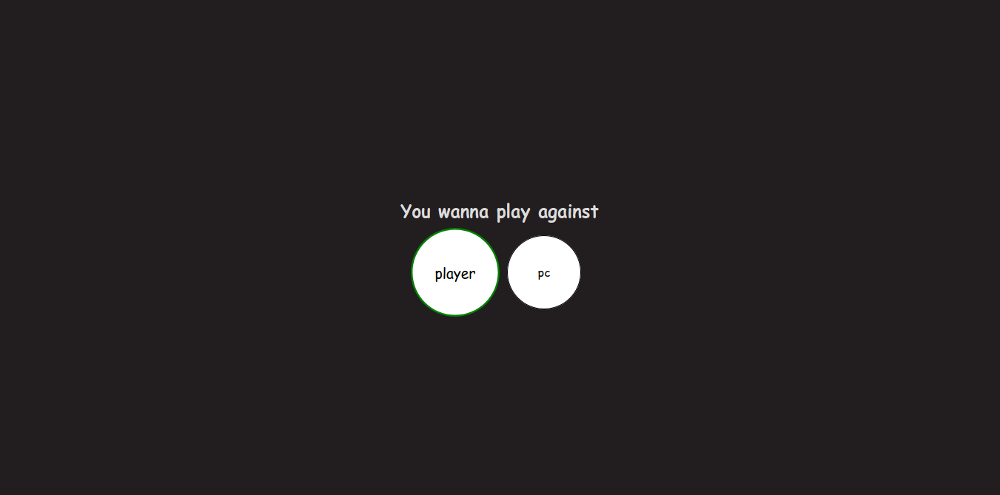
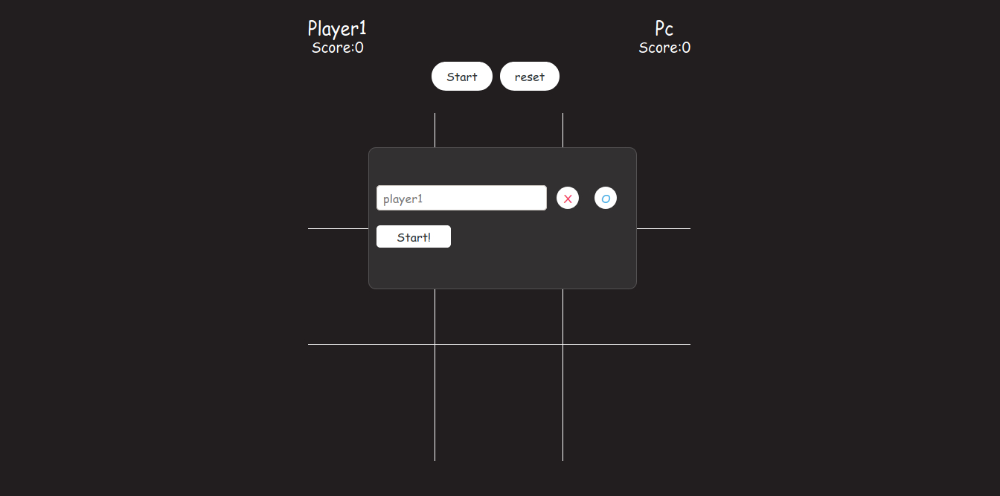
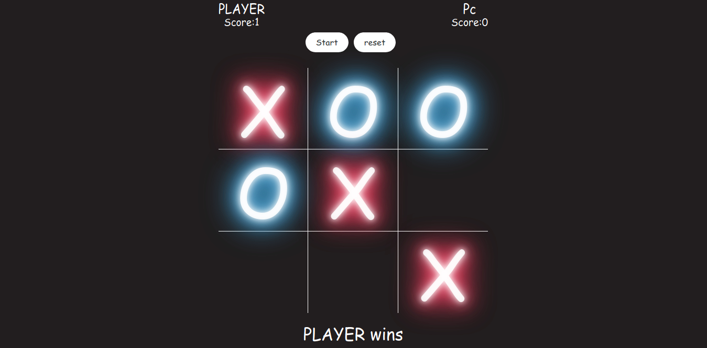

# Tic Tac Toe
This a simple Tic-Tac-Toe to play with your friends, I enjoyed making this project and upload it, You could choice one of two choices, Multiplayer or Play agains PC, You choose X or O, The player who succeeds in placing three of their marks in a horizontal, vertical, or diagonal row is the winner,
To win the game you must win three rounds.
I learned so much from it and how objects works in javaScript and it improves my skills in DOM and objects manipulation.

## Table of contents

* [General info](#general-info)
* [Screenshots](#screenshots)
* [Technologies](#technologies)
* [Setup](#setup)
* [Features](#features)
* [Status](#status)
* [Inspiration](#inspiration)
* [Contact](#contact)

## General info
I made this project to improve my skills in javaScript in general, Also to specifcally improve the knowledge of objects in javaScript and how the constructor is used in javaScript, Also learn about factories and module design pattern and when to use factories and module, It was so much fun and intersting journey to make it.

## Screenshots

## Technologies
* Vanilla javaScript
* HTML
* CSS

## Setup
If you wanna to check the game go to this live preview --> https://htmlpreview.github.io/?https://github.com/sheehaab/Tic-Tac-Toe/blob/master/index.html

## Features
List of features ready and TODOs for future development

* Choose to play agianst friend or PC
* Choose to play with X or O
* Simple UI
* Fast

To-do list:

* Make the AI unbeatble

## Status
Project is: in progress.

## Inspiration
Project inspired by @TheOdinProject

## Contact
Created by @sheehaab - feel free to contact me!  
Linkedin: https://www.linkedin.com/in/shehaab-ahmed/
